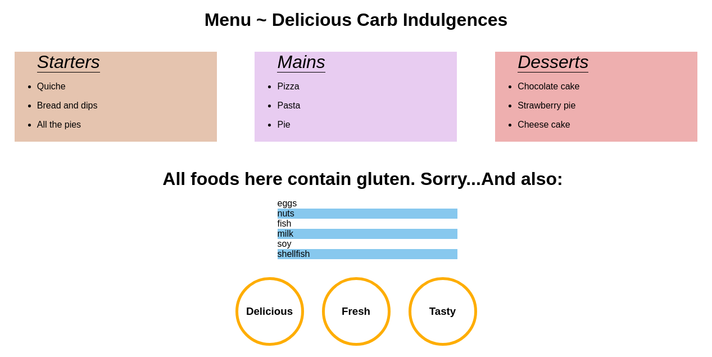

# Menu Styling 
In the repository, there is an `index.html` starting file which has the skeleton of an online menu. Style the menu by following the instructions below. 

**Rules**: 
* All changes to the menu should be done in JavaScript! No CSS!!
* The page should be responsive.

**Images**:

